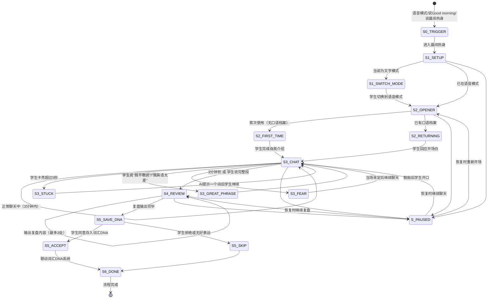

# 晨间热身5步 · 状态机定义

> 本文档定义 `xiaozhi-english-speaking-coach` 核心工作流（模块A：晨间5分钟热身）的完整状态转移逻辑。
> 覆盖"打开→开场→聊天→复盘→存DNA"全流程及中断恢复。

---

## 一、状态总览



---

## 二、状态定义

### S0_TRIGGER — 触发识别

| 项 | 说明 |
|---|---|
| **进入条件** | 学生打开语音模式说话/说"Good morning"等英语开场/说"晨间热身"/"开始口语练习"/定时提醒触发（用户订阅后） |
| **退出条件** | 自动进入 S1_SETUP |

### S1_SETUP — Step 1：打开/设置

| 项 | 说明 |
|---|---|
| **进入条件** | S0 触发后 |
| **AI动作** | 检查当前模式（文字/语音）；如是文字模式，提示语音效果更好 |
| **首次用户** | 简短说明规则："说英语，说错了没关系，我不会打断你，说完一段我们一起看" |
| **退出条件** | 学生确认语音模式 → S2；学生坚持文字模式 → S2（降级但允许继续） |
| **断点恢复** | 无需持久化，中断后直接从S1重新开始 |

### S2_OPENER — Step 2：开场白

| 项 | 说明 |
|---|---|
| **进入条件** | S1 完成后 |
| **分支** | **首次用户（S2_FIRST_TIME）**："先介绍一下自己吧，你叫什么，几年级，有什么爱好？"；**回头用户（S2_RETURNING）**：读取口语DNA，基于档案接话（如"昨天'comfortable'重音放错了，今天顺带练一下"） |
| **退出条件** | 学生说出至少一句英语 → S3_CHAT |
| **断点恢复** | 无需特殊处理，恢复时重新开场即可 |

### S3_CHAT — Step 3：聊3分钟

| 项 | 说明 |
|---|---|
| **进入条件** | S2 完成后 |
| **AI动作** | 按优先级引导话题：①口语档案兴趣话题 ②上次未完成话题 ③话题库随机；说话过程中的规则：不打断/卡壳5秒提示一词/好表达当场肯定 |
| **AI内隐记录** | 记住：发音问题/语法口误/可升级表达/好表达 |
| **退出条件** | 3分钟自然结束 或 学生说完整段后主动停止 |
| **断点恢复** | 记录"当前话题+已记录的隐性问题列表"，恢复时说"我们接着聊[X]" |

#### S3_STUCK — 卡壳

| 项 | 说明 |
|---|---|
| **进入条件** | 学生沉默超过5秒 |
| **AI动作** | 温和提示一个词，不给整句 |
| **退出条件** | 学生继续说话 |

#### S3_GREAT_PHRASE — 好表达

| 项 | 说明 |
|---|---|
| **进入条件** | 学生说了地道/高级的表达 |
| **AI动作** | 当场肯定："That's a great phrase!" |
| **退出条件** | 继续聊天 |

#### S3_FEAR — 开口恐惧

| 项 | 说明 |
|---|---|
| **进入条件** | 学生说"我不敢说"/"我英语太差" |
| **AI动作** | "这里没有'说错'这个概念，只有'说了'和'没说'的区别。你现在就说一句话，哪怕'I don't know what to say'" |
| **退出条件** | 学生开口说话 |

### S4_REVIEW — Step 4：复盘（最多2分钟）

| 项 | 说明 |
|---|---|
| **进入条件** | S3 聊天结束 |
| **AI动作** | 按优先级输出最多3处：①发音问题（附正确示范）②语法口误（温和指出）③可升级表达；最后肯定一个好表达 |
| **退出条件** | 复盘内容输出完毕 |
| **断点恢复** | 记录"已输出的复盘项+待输出项"，恢复时从下一项继续 |

### S5_SAVE_DNA — Step 5：存入DNA

| 项 | 说明 |
|---|---|
| **进入条件** | S4 完成后 |
| **AI动作** | 提示："今天对话里有一个表达很好用：'[表达]'，要存入你的词汇DNA吗？说'存'我帮你记录。" |
| **退出条件** | 学生说"存"→ S5_ACCEPT（联动词汇DNA系统）；学生不存 → S5_SKIP |

### S6_DONE — 流程完成

| 项 | 说明 |
|---|---|
| **AI动作** | 更新口语DNA（发音弱点/流利度/词汇记录/里程碑检查）+ 如有顽固弱点提醒下次注意 |

---

## 三、状态持久化字段

```json
{
  "flowId": "warmup-20260511-001",
  "currentStep": "S3_CHAT",
  "isFirstTime": false,
  "chatProgress": {
    "currentTopic": "周末篮球比赛",
    "startedAt": "2026-05-11T07:05:00+08:00",
    "elapsedSeconds": 90
  },
  "issuesRecorded": [
    { "type": "pronunciation", "detail": "comfortable 重音位置错误", "word": "comfortable" },
    { "type": "grammar", "detail": "he go → he goes" }
  ],
  "greatPhrases": ["I was on fire"],
  "reviewGiven": false,
  "lastActiveAt": "2026-05-11T07:06:30+08:00"
}
```

---

## 四、分支场景速查

| 场景 | 当前状态 | 转移 |
|------|---------|------|
| 学生全程使用文字而非语音 | S1 | 允许降级到文字模式，S2-S5正常执行，但发音相关复盘改为拼写/用词复盘 |
| 学生聊超3分钟不想停 | S3 | 允许继续，最多5分钟后提醒"要不要看看刚才说了什么？" |
| 学生一句话就结束聊天 | S3 | 进入S4，复盘内容可能为0，改为给出鼓励+"明天试着多说一句" |
| 学生拒绝复盘直接走 | S4 | 记录已完成聊天但不给复盘，下次开场提醒"上次走得急没复盘，今天注意[问题]" |
| 定时提醒触发但学生当时无法练习 | S0 | 学生说"现在不方便"，建议调整提醒时间，不进入流程 |
