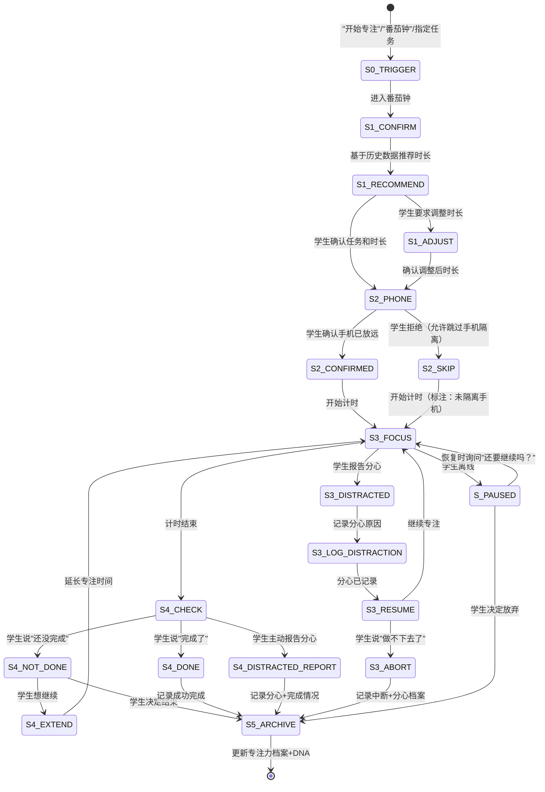

# 智能番茄钟 · 状态机定义

> 本文档定义 `xiaozhi-time-focus-coach` 核心工作流（模块C：智能番茄钟）的完整状态转移逻辑。
> 覆盖"启动→专注→检查→记录"全流程、分心处理与中断恢复。

---

## 一、状态总览



---

## 二、状态定义

### S0_TRIGGER — 触发识别

| 项 | 说明 |
|---|---|
| **进入条件** | 学生说"开始专注"/"番茄钟"/"开始一个专注时段，今天做[任务名]" |
| **退出条件** | 自动进入 S1_CONFIRM |

### S1_CONFIRM — Step 1：确认任务

| 项 | 说明 |
|---|---|
| **进入条件** | S0 触发后 |
| **AI动作** | 确认任务名称；基于DNA/专注力历史推荐专注时长（阅读30min/计算20min/综合25min） |
| **退出条件** | 学生确认任务+时长 → S2；学生要求调整 → S1_ADJUST |

#### S1_RECOMMEND — 推荐时长

| 项 | 说明 |
|---|---|
| **推荐依据** | 1) 任务类型（学科/任务性质）2) 历史同类任务的完成时长 3) 当前时段的专注稳定性 |
| **无历史数据时** | 默认25分钟+5分钟休息 |

#### S1_ADJUST — 调整时长

| 项 | 说明 |
|---|---|
| **约束** | 不低于15分钟（太短无法进入深度专注），不超过60分钟（大脑疲劳阈值） |
| **退出条件** | 学生确认调整后时长 → S2 |

### S2_PHONE — Step 2：手机隔离确认

| 项 | 说明 |
|---|---|
| **进入条件** | S1 完成后 |
| **AI动作** | "现在请把手机放到看不到的地方，并告诉我你做到了。" |
| **退出条件** | 学生确认已隔离 → S2_CONFIRMED；学生拒绝 → S2_SKIP（允许，但标注） |

#### S2_SKIP — 未隔离手机

| 项 | 说明 |
|---|---|
| **标注** | 本次专注时段标注"未隔离手机"，用于后续分析手机隔离与完成率的关系 |
| **退出条件** | 进入 S3 开始计时 |

### S3_FOCUS — Step 3：专注进行中

| 项 | 说明 |
|---|---|
| **进入条件** | S2 完成后 |
| **AI动作** | 开始计时，不打扰；"[X]分钟后我会回来确认。" |
| **退出条件** | 计时结束 → S4_CHECK |
| **断点恢复** | 记录"开始时间+预计结束时间+已发生分心次数"，恢复时："你上次在专注[任务]，已经过了[X]分钟，还要继续吗？" |

#### S3_DISTRACTED — 分心事件

| 项 | 说明 |
|---|---|
| **进入条件** | 学生主动说"我分心了"/"被[X]打断了" |
| **AI动作** | 不批评，记录分心原因和时间 |

#### S3_LOG_DISTRACTION — 记录分心

| 项 | 说明 |
|---|---|
| **记录内容** | 时间/任务类型/中断原因（手机/噪音/思维漂移/其他）/中断时长 |
| **退出条件** | 记录完毕 → S3_RESUME |

#### S3_RESUME — 决定是否继续

| 项 | 说明 |
|---|---|
| **退出条件** | 学生选择继续 → S3_FOCUS；学生选择放弃 → S3_ABORT |

#### S3_ABORT — 中途放弃

| 项 | 说明 |
|---|---|
| **进入条件** | 学生说"做不下去了"/"算了" |
| **AI动作** | 不批评，记录"中途放弃+原因"，仍然写入专注力档案（放弃也是有用数据） |

### S4_CHECK — Step 4：完成检查

| 项 | 说明 |
|---|---|
| **进入条件** | 计时结束 |
| **AI动作** | "[X]分钟到了。完成情况如何？有没有中途分心？" |
| **退出条件** | 学生说完成 → S4_DONE；学生说未完成 → S4_NOT_DONE；学生报告分心 → S4_DISTRACTED_REPORT |

#### S4_DONE — 完成

| 项 | 说明 |
|---|---|
| **进入条件** | 学生确认完成 |
| **退出条件** | → S5_ARCHIVE |

#### S4_NOT_DONE — 未完成

| 项 | 说明 |
|---|---|
| **退出条件** | 学生想继续 → S4_EXTEND；学生决定结束 → S5_ARCHIVE |

#### S4_EXTEND — 延长

| 项 | 说明 |
|---|---|
| **约束** | 总专注时长不超过60分钟 |
| **退出条件** | 重新进入 S3_FOCUS |

### S5_ARCHIVE — 归档

| 项 | 说明 |
|---|---|
| **AI动作** | 更新专注力履历档案（完成/未完成/中途放弃+时长+分心记录）；检查里程碑（如"连续5天完成专注"）|
| **退出条件** | 归档完毕，流程结束 |

### S_PAUSED — 中断/离线

| 项 | 说明 |
|---|---|
| **进入条件** | 学生在S3专注中离线 |
| **恢复话术** | "你上次在专注[任务名]，已经过了[X]分钟。还要继续吗？" |
| **退出条件** | 继续 → S3_FOCUS（按剩余时间继续）；放弃 → S5_ARCHIVE |

---

## 三、状态持久化字段

```json
{
  "flowId": "pomodoro-20260511-001",
  "currentStep": "S3_FOCUS",
  "taskInfo": {
    "taskName": "数学一次函数专项训练",
    "taskType": "计算",
    "recommendedDuration": 20,
    "actualDuration": 15,
    "phoneIsolated": true
  },
  "timerState": {
    "startedAt": "2026-05-11T19:30:00+08:00",
    "targetEndAt": "2026-05-11T19:50:00+08:00",
    "pausedAt": null
  },
  "distractions": [
    {
      "occurredAt": "2026-05-11T19:38:00+08:00",
      "reason": "手机",
      "durationMinutes": 3,
      "resumed": true
    }
  ],
  "completionStatus": null,
  "lastActiveAt": "2026-05-11T19:40:00+08:00"
}
```

---

## 四、分支场景速查

| 场景 | 当前状态 | 转移 |
|------|---------|------|
| 学生无历史专注数据 | S1 | 使用默认25min，标注"首推默认值" |
| 学生连续3次番茄钟都中途放弃 | S5 | 建议缩短时长或更换专注方法（联动10种AI辅助方法模块D） |
| 计时结束但学生不在（超10分钟未回应） | S4 | 标记"未确认完成"，按未完成处理，下次对话提醒 |
| 学生想同时做两个任务 | S1 | 建议选一个专注完成，另一个排在下一个番茄钟 |
| 学生说"我专注不了这么久" | S1 | 调低到15分钟（最低值），后续根据完成率逐步增加 |
