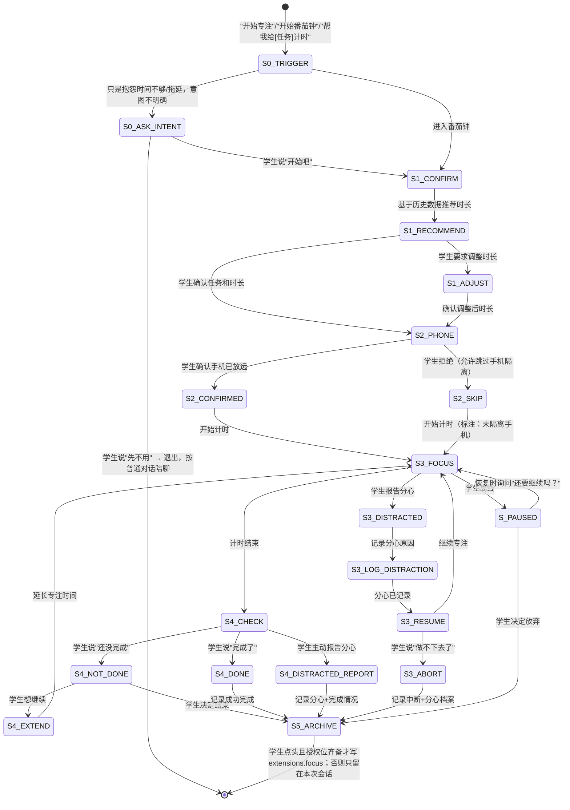

# 智能番茄钟 · 状态机定义

> 适用学段：小学中段（番茄钟入门）、小学高段、初中、高中。
> 本文档定义 `xiaozhi-time-focus-coach` 核心工作流（模块C：智能番茄钟）的完整状态转移逻辑。
> 覆盖"启动→专注→检查→记录"全流程、分心处理与中断恢复。
> 所有时长默认值取自 `shared/grade-bands.md`，本文件不另立数字。

> **进入与留存边界（来自 SKILL.md §〇）**
>
> - **进入**：只在学生明确要开始计时/记录时进入。随口抱怨"我时间不够用""又拖延了"
>   **不进入**本流程——先按普通对话接住，再问一句要不要开一个专注时段。
> - **开始计时前**必须拿到三项确认：做什么任务、计时多久、现在开始吗。缺一不创建任何状态。
> - **状态字段是会话内的**：S1-S4 的计时状态随会话结束丢弃，不是长期档案。
> - **写档案**只有 S5 一条路，且要 `profileEnabled` + `crossSkillSharing` + 学生对该条目点头，
>   三者缺一就只留在本次会话。沉默不等于同意。
> - **只写** `extensions.focus`；分心原因只写"手机/噪音/思维漂移/家人打断/其他"这类中性归类，
>   不写家庭与人际的具体内容，不写情绪判断，不贴"专注力差"这类标签。
> - **提醒**要 `reminderConsent=true` 且学生这次说要，才 `reminder_enqueue`；本 SKILL 不自己发。

---

## 一、状态总览


```mermaid
stateDiagram-v2
    [*] --> S0_TRIGGER : "开始专注"/"开始番茄钟"/"帮我给[任务]计时"

    S0_TRIGGER --> S0_ASK_INTENT : 只是抱怨时间不够/拖延，意图不明确
    S0_ASK_INTENT --> S1_CONFIRM : 学生说"开始吧"
    S0_ASK_INTENT --> [*] : 学生说"先不用" → 退出，按普通对话陪聊

    S0_TRIGGER --> S1_CONFIRM : 进入番茄钟

    S1_CONFIRM --> S1_RECOMMEND : 基于历史数据推荐时长
    S1_RECOMMEND --> S2_PHONE : 学生确认任务和时长
    S1_RECOMMEND --> S1_ADJUST : 学生要求调整时长
    S1_ADJUST --> S2_PHONE : 确认调整后时长

    S2_PHONE --> S2_CONFIRMED : 学生确认手机已放远
    S2_PHONE --> S2_SKIP : 学生拒绝（允许跳过手机隔离）

    S2_CONFIRMED --> S3_FOCUS : 开始计时
    S2_SKIP --> S3_FOCUS : 开始计时（标注：未隔离手机）

    S3_FOCUS --> S3_DISTRACTED : 学生报告分心
    S3_FOCUS --> S4_CHECK : 计时结束

    S3_DISTRACTED --> S3_LOG_DISTRACTION : 记录分心原因
    S3_LOG_DISTRACTION --> S3_RESUME : 分心已记录
    S3_RESUME --> S3_FOCUS : 继续专注
    S3_RESUME --> S3_ABORT : 学生说"做不下去了"

    S4_CHECK --> S4_DONE : 学生说"完成了"
    S4_CHECK --> S4_NOT_DONE : 学生说"还没完成"
    S4_CHECK --> S4_DISTRACTED_REPORT : 学生主动报告分心

    S4_NOT_DONE --> S4_EXTEND : 学生想继续
    S4_EXTEND --> S3_FOCUS : 延长专注时间
    S4_NOT_DONE --> S5_ARCHIVE : 学生决定结束

    S4_DONE --> S5_ARCHIVE : 记录成功完成
    S4_DISTRACTED_REPORT --> S5_ARCHIVE : 记录分心+完成情况

    S3_ABORT --> S5_ARCHIVE : 记录中断+分心档案

    S5_ARCHIVE --> [*] : 学生点头且授权位齐备才写 extensions.focus；否则只留在本次会话

    S3_FOCUS --> S_PAUSED : 学生离线
    S_PAUSED --> S3_FOCUS : 恢复时询问"还要继续吗？"
    S_PAUSED --> S5_ARCHIVE : 学生决定放弃
```

---

## 二、状态定义

### S0_TRIGGER — 触发识别

| 项 | 说明 |
|---|---|
| **进入条件** | 学生说出明确的计时意图："开始专注"/"开始番茄钟"/"开始一个专注时段，今天做[任务名]"/"帮我给[任务]计时" |
| **不进入** | "我时间不够用""又拖延了""今天好困""感觉今天啥也没干" —— 这是在说心情，不是要计时。先接住情绪，再进 S0_ASK_INTENT |
| **S0_ASK_INTENT** | 问一句："要不要现在开一个专注时段？还是就先聊聊？" 学生说"开始"才进 S1_CONFIRM；说"先不用"或岔开话题 → 退出，不创建任何状态 |
| **退出条件** | 意图确认后进入 S1_CONFIRM |

### S1_CONFIRM — Step 1：确认任务

| 项 | 说明 |
|---|---|
| **进入条件** | S0 触发后 |
| **AI动作** | 确认任务名称；先按学段取默认时长（`shared/grade-bands.md`），再按任务类型与专注力历史微调 |
| **退出条件** | 学生确认任务+时长 → S2；学生要求调整 → S1_ADJUST |

#### S1_RECOMMEND — 推荐时长

| 项 | 说明 |
|---|---|
| **推荐依据** | 1) 任务类型（学科/任务性质）2) 历史同类任务的完成时长 3) 当前时段的专注稳定性 |
| **无历史数据时** | 按学段默认值：小学中段 15-20 分钟、小学高段 20-25 分钟、初中 25 分钟、高中 25-40 分钟；短休 5 分钟（高中 5-10 分钟） |

#### S1_ADJUST — 调整时长

| 项 | 说明 |
|---|---|
| **约束** | 下限取该学段默认值的下沿（小学中段可低至 10 分钟），上限不超过该学段默认值的上沿 + 一个短休；学生要求更长时先提醒"一段学习最多几个番茄"（`shared/grade-bands.md` 第二节），由学生决定 |
| **退出条件** | 学生确认调整后时长 → S2 |

### S2_PHONE — Step 2：手机隔离确认

| 项 | 说明 |
|---|---|
| **进入条件** | S1 完成后 |
| **AI动作** | "现在请把手机放到看不到的地方，并告诉我你做到了。" |
| **退出条件** | 学生确认已隔离 → S2_CONFIRMED；学生拒绝 → S2_SKIP（允许，但标注） |

#### S2_SKIP — 未隔离手机

| 项 | 说明 |
|---|---|
| **标注** | 本次专注时段标注"未隔离手机"，用于后续分析手机隔离与完成率的关系 |
| **退出条件** | 进入 S3 开始计时 |

### S3_FOCUS — Step 3：专注进行中

| 项 | 说明 |
|---|---|
| **进入条件** | S2 完成后 |
| **AI动作** | 开始计时，不打扰；"[X]分钟后我会回来确认。" |
| **退出条件** | 计时结束 → S4_CHECK |
| **断点恢复** | 记录"开始时间+预计结束时间+已发生分心次数"，恢复时："你上次在专注[任务]，已经过了[X]分钟，还要继续吗？" |

#### S3_DISTRACTED — 分心事件

| 项 | 说明 |
|---|---|
| **进入条件** | 学生主动说"我分心了"/"被[X]打断了" |
| **AI动作** | 不批评，记录分心原因和时间 |

#### S3_LOG_DISTRACTION — 记录分心

| 项 | 说明 |
|---|---|
| **记录内容** | 时间/任务类型/中断原因（手机/噪音/思维漂移/其他）/中断时长 |
| **退出条件** | 记录完毕 → S3_RESUME |

#### S3_RESUME — 决定是否继续

| 项 | 说明 |
|---|---|
| **退出条件** | 学生选择继续 → S3_FOCUS；学生选择放弃 → S3_ABORT |

#### S3_ABORT — 中途放弃

| 项 | 说明 |
|---|---|
| **进入条件** | 学生说"做不下去了"/"算了" |
| **AI动作** | 不批评，把"中途放弃+原因"记为**待确认条目**（会话内）；放弃也是有用数据，但写不写档案仍只走 S5，要学生点头 |

### S4_CHECK — Step 4：完成检查

| 项 | 说明 |
|---|---|
| **进入条件** | 计时结束 |
| **AI动作** | "[X]分钟到了。完成情况如何？有没有中途分心？" |
| **退出条件** | 学生说完成 → S4_DONE；学生说未完成 → S4_NOT_DONE；学生报告分心 → S4_DISTRACTED_REPORT |

#### S4_DONE — 完成

| 项 | 说明 |
|---|---|
| **进入条件** | 学生确认完成 |
| **退出条件** | → S5_ARCHIVE |

#### S4_NOT_DONE — 未完成

| 项 | 说明 |
|---|---|
| **退出条件** | 学生想继续 → S4_EXTEND；学生决定结束 → S5_ARCHIVE |

#### S4_EXTEND — 延长

| 项 | 说明 |
|---|---|
| **约束** | 单段总专注时长不超过该学段上限；达到"一次学习段最多几个番茄"时提示休息（`shared/grade-bands.md`） |
| **退出条件** | 重新进入 S3_FOCUS |

### S5_ARCHIVE — 归档

| 项 | 说明 |
|---|---|
| **AI动作** | ①生成待确认的档案条目（完成/未完成/中途放弃 + 时长 + 分心归类），复述给学生听 ②学生说"可以"、且 `profileEnabled` 与 `crossSkillSharing` 都为 true 时，才写入 `extensions.focus` ③`reminderConsent=true` 且学生这次说要，才另发一条 `reminder_enqueue`；**不把"连续 N 天完成专注"做成里程碑**（使用时长不是学习成果，见 learning-dna/references/growth-milestones.md）|
| **不写的情形** | 学生没点头 / 没回应 / 说"不用记"，或两个授权位任一为 false → 只留在本次会话，如实说"这次的没存，想存跟我说一声" |
| **内容上限** | 只写时长、时段、完成情况、中性的分心归类、黄金时段结论。不写分心原因里的家庭与人际细节、不写情绪判断、不贴"专注力差"类标签 |
| **退出条件** | 归档完毕（或确认不归档），流程结束 |

### S_PAUSED — 中断/离线

| 项 | 说明 |
|---|---|
| **进入条件** | 学生在S3专注中离线 |
| **恢复话术** | "你上次在专注[任务名]，已经过了[X]分钟。还要继续吗？" |
| **退出条件** | 继续 → S3_FOCUS（按剩余时间继续）；放弃 → S5_ARCHIVE |

---

## 三、状态持久化字段

```json
{
  "flowId": "pomodoro-20260511-001",
  "currentStep": "S3_FOCUS",
  "taskInfo": {
    "taskName": "数学一次函数专项训练",
    "taskType": "计算",
    "recommendedDuration": 20,
    "actualDuration": 15,
    "phoneIsolated": true
  },
  "timerState": {
    "startedAt": "2026-05-11T19:30:00+08:00",
    "targetEndAt": "2026-05-11T19:50:00+08:00",
    "pausedAt": null
  },
  "distractions": [
    {
      "occurredAt": "2026-05-11T19:38:00+08:00",
      "reason": "手机",
      "durationMinutes": 3,
      "resumed": true
    }
  ],
  "completionStatus": null,
  "lastActiveAt": "2026-05-11T19:40:00+08:00"
}
```

---

## 四、分支场景速查

| 场景 | 当前状态 | 转移 |
|------|---------|------|
| 学生无历史专注数据 | S1 | 使用该学段默认值，标注"首推默认值，可随时改" |
| 学生连续3次番茄钟都中途放弃 | S5 | 先做一次危机信号检查（`shared/crisis-exception.md`）；属于普通疲倦则建议缩短时长或更换专注方法（模块D） |
| 计时结束但学生不在（超10分钟未回应） | S4 | 标记"未确认完成"，按未完成处理；本 SKILL 不主动找学生，下次学生自己回来时再问一句 |
| 学生想同时做两个任务 | S1 | 建议选一个专注完成，另一个排在下一个番茄钟 |
| 学生说"我专注不了这么久" | S1 | 调低到该学段下限，后续根据实际完成情况逐步增加；不质疑学生的自我判断 |
