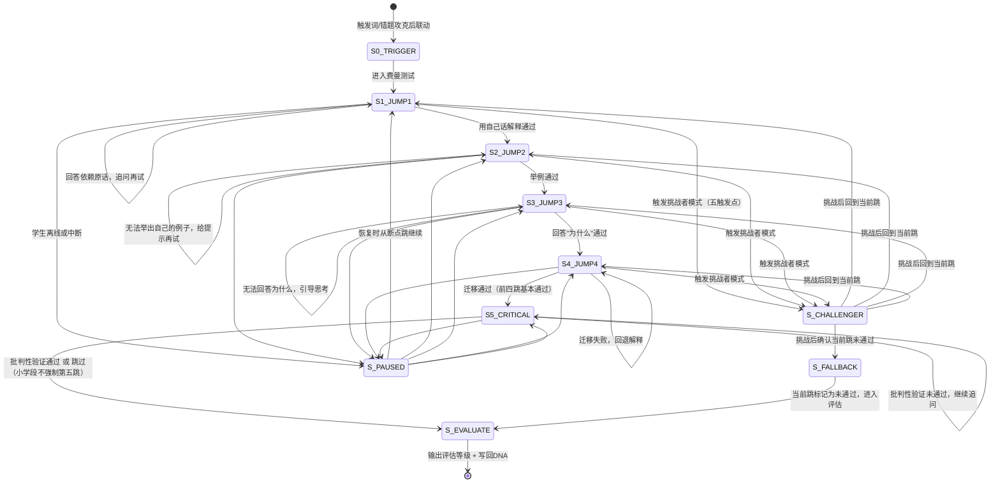

# 费曼4+1跳验证 · 状态机定义

> 本文档定义 `xiaozhi-feynman-test` 核心工作流（四跳验证 + 第五跳批判性验证 + 苏格拉底挑战者模式）的完整状态转移逻辑。

---

## 一、状态总览



---

## 二、状态定义

### S0_TRIGGER — 触发识别

| 项 | 说明 |
|---|---|
| **进入条件** | 学生说"我来给你讲讲"/"我懂了想测试一下"/"帮我检验一下"；错题本攻克后联动；考前自检 |
| **AI动作** | 确认测试知识点，说明规则（"你来讲，我来听和追问"） |
| **退出条件** | 学生确认知识点 → S1 |

### S1_JUMP1 — 第1跳：用自己的话解释概念

| 项 | 说明 |
|---|---|
| **进入条件** | S0 完成后 |
| **AI动作** | "你先把知识点讲给一个比你小两岁的同学听，用你自己的话" |
| **自循环条件** | 学生回答几乎全是标准答案原话 → 追问"不用原话，换个说法" |
| **退出条件** | 学生用自己的话表达了核心含义（无需完美，但不是照念） |
| **触发挑战者** | 触发点一：全是标准答案原话 |
| **断点恢复** | 记录"第1跳：学生已说[X]，需继续追问"，恢复时说"上次你讲到了[X]，我们继续" |

### S2_JUMP2 — 第2跳：自己举一个例子

| 项 | 说明 |
|---|---|
| **进入条件** | 第1跳通过 |
| **AI动作** | "你自己举一个例子，最好不是课本里的" |
| **自循环条件** | 学生举的是课本原例 → 追问"能不能想一个你身边的例子？" |
| **退出条件** | 学生举出了非课本的、自己的例子 |
| **触发挑战者** | 触发点三：换个例子就卡住 |
| **断点恢复** | 记录"第2跳：学生已举[X]例"，恢复时说"上次你举了[X]的例子，我们接着" |

### S3_JUMP3 — 第3跳：回答"为什么"

| 项 | 说明 |
|---|---|
| **进入条件** | 第2跳通过 |
| **AI动作** | "为什么这里要这样做？背后的理由是什么？为什么不能换一种方式？" |
| **自循环条件** | 学生只说了"就是这样" → 追问"如果换成[另一种方式]会怎样？" |
| **退出条件** | 学生能说明至少一个理由或因果逻辑 |
| **触发挑战者** | 触发点二：会说步骤不会说理由；触发点四：结论坚定但论证空洞 |
| **断点恢复** | 记录"第3跳：学生回答了[X]，需进一步追问"，恢复时说"你上次说[X]，我再深追一下" |

### S4_JUMP4 — 第4跳：迁移到新情境

| 项 | 说明 |
|---|---|
| **进入条件** | 第3跳通过 |
| **AI动作** | "如果把条件改一下/换个场景，你还会怎么处理？" |
| **自循环条件** | 学生迁移失败 → 回退到第3跳层面补充解释，再尝试迁移 |
| **退出条件** | 学生能将知识应用到新条件/新场景 |
| **触发挑战者** | 触发点三：换个例子就卡住 |
| **断点恢复** | 记录"第4跳：学生迁移场景[X]失败/部分成功"，恢复时说"上次换到[X]场景你卡住了，再试试" |

### S5_CRITICAL — 第5跳：批判性验证

| 项 | 说明 |
|---|---|
| **进入条件** | 前四跳基本通过 |
| **年龄适配** | **小学段（7-12岁）**：找茬游戏化（"有个同学说[故意说错的结论]，你觉得哪里不对？"），不强制通过；**中学段（13-16岁）**：边界与逻辑验证（"这套说法有没有适用边界？"） |
| **自循环条件** | 学生无法找到漏洞/边界 → 进一步提示 |
| **退出条件** | 中学段：学生能识别边界条件或找到逻辑漏洞；小学段：不强制通过，尝试后即进入评估 |
| **跳过条件** | 小学段若学生明显无法理解"找茬"概念，可跳过第五跳直接进入评估（评估等级上限为B） |
| **断点恢复** | 记录"第5跳：验证方式（小学/中学）+ 学生当前回答"，恢复时说"上次我们在验证[知识点]的边界，继续" |

### S_CHALLENGER — 苏格拉底挑战者模式

| 项 | 说明 |
|---|---|
| **进入条件** | 五触发点任一命中：①全是原话 ②会说步骤不会说理由 ③换例子卡住 ④结论坚定论证空洞 ⑤复制AI话术 |
| **AI动作** | "我想当一下你的挑战者——如果这个条件改掉，你刚才的解释还成立吗？" |
| **退出条件** | 学生在挑战后能重新解释 → 回到当前跳重新评估；学生无法应对挑战 → S_FALLBACK |
| **关键约束** | 不是刁难，是帮助学生从"会背"走向"会判断"；每跳最多触发一次挑战者模式 |

### S_FALLBACK — 当前跳未通过

| 项 | 说明 |
|---|---|
| **进入条件** | 挑战者模式后确认学生当前跳无法通过 |
| **AI动作** | 记录卡住位置，不批评，给出鼓励："这个点确实难，我们先到这里，回头再来" |
| **退出条件** | 自动进入 S_EVALUATE |

### S_PAUSED — 中断/离线

| 项 | 说明 |
|---|---|
| **进入条件** | 学生在任何跳离线或中断 |
| **AI动作** | 持久化当前状态 |
| **恢复话术** | "上次我们在做[知识点]的费曼测试，你走到了[第N跳]。要接着来吗？" |

### S_EVALUATE — 评估与归档

| 项 | 说明 |
|---|---|
| **进入条件** | 第五跳完成/跳过 或 任意跳未通过进入 |
| **AI动作** | 给出评估等级（A/B/C/D）+ 写回DNA理解深度档案 + 建议后续动作 |
| **评估标准** | A=真正掌握（4跳全通过+第五跳通过）；B=基本理解（4跳通过但第五跳未通过/跳过）；C=表面看懂（1-2跳通过）；D=完全未懂（第1跳就卡住） |
| **后续** | 流程结束 |

---

## 三、状态持久化字段

```json
{
  "flowId": "feynman-20260511-001",
  "knowledgePoint": "一次函数解析式推导",
  "currentJump": 3,
  "jumpResults": {
    "jump1": { "passed": true, "studentAnswer": "就是用两个点代入求k和b" },
    "jump2": { "passed": true, "studentAnswer": "比如知道(1,3)和(2,5)两个点" },
    "jump3": { "passed": false, "studentAnswer": null, "stuckReason": "只能说步骤，说不清为什么两个点就能确定" },
    "jump4": { "passed": null },
    "jump5": { "passed": null, "skipped": false }
  },
  "challengerTriggered": false,
  "ageGroup": "中学段",
  "lastActiveAt": "2026-05-11T20:30:00+08:00"
}
```

---

## 四、分支场景速查

| 场景 | 当前状态 | 转移 |
|------|---------|------|
| 学生看了AI答案后说"我懂了" | S0 | 启动"AI答案主动验证"（"不用AI原话，你自己讲一遍"）→ S1 |
| 学生在多跳之间反复跳跃（第2跳过但第3跳卡住后回到第1跳解释更好了） | S3 | 允许回退：重新评估第1-2跳是否需要更新，然后从第3跳继续 |
| 费曼测试由错题本联动触发 | S0 | 直接进入S1，知识点由错题本传入 |
| 学生在第4跳后说"太累了不想继续" | S4 | S_PAUSED 或 S_EVALUATE（按学生意愿，已完成4跳可给B级评估） |
| 学生主动要求做亲子费曼日 | S0 | 进入特殊模式：家长做听众和提问者，流程不变但角色标注不同 |
