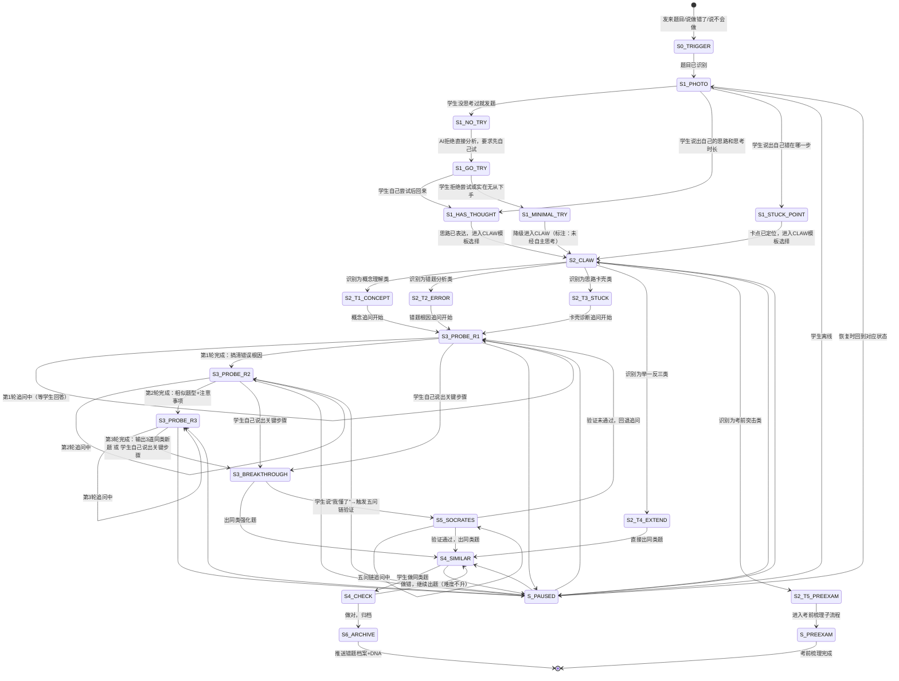

# 数学四步拍照法 · 状态机定义

> 本文档定义 `xiaozhi-math-problem-solving-coach` 核心工作流（模块A：四步拍照法）的完整状态转移逻辑。
> 覆盖"拍题→CLAW提问→三轮追问→出同类题"全流程及中断恢复。

---

## 一、状态总览



---

## 二、状态定义

### S0_TRIGGER — 触发识别

| 项 | 说明 |
|---|---|
| **进入条件** | 学生发来数学题目（图片/文字）/"我做错了这道题"/"我不知道怎么做"/"帮我看看这道题" |
| **AI动作** | 识别题目内容（图片→OCR/多模态）；识别失败时进入降级流程 |
| **退出条件** | 题目内容已理解 → S1 |

### S1_PHOTO — Step 1：拍照题目，但不要直接要答案

| 项 | 说明 |
|---|---|
| **进入条件** | S0 完成后 |
| **核心原则** | 拍照之前必须自己试过。没思考过就拍照的题，AI的解释几乎没用——大脑没有接应的地方，信息无法落地 |
| **AI动作** | 永远先追问，不解题。"你思考了多长时间？目前的思路是什么？请不要直接要答案，让我引导你思考。" |
| **退出条件** | 三种分支：没思考过 → S1_NO_TRY；说出部分思路/思考时长 → S1_HAS_THOUGHT；说出错在哪一步 → S1_STUCK_POINT |
| **断点恢复** | 记录"题目信息+是否已收集学生思路"，恢复时问"上次那道[题型]你做出来了吗？" |

#### S1_NO_TRY — 学生没思考过就发题

| 项 | 说明 |
|---|---|
| **进入条件** | 学生直接发题目图片但没说任何思路，或者说"直接帮我做" |
| **AI动作** | 拒绝直接分析，要求先自己尝试："先自己试3分钟，做到哪一步都可以，然后再告诉我你的思路。我不会直接给答案，但我会帮你找到卡住的地方。" |
| **退出条件** | 学生去尝试后回来 → S1_HAS_THOUGHT |

#### S1_MINIMAL_TRY — 实在无从下手

| 项 | 说明 |
|---|---|
| **进入条件** | 学生尝试后仍完全无思路，或拒绝尝试 |
| **AI动作** | 已知条件清单三问：①列出已知条件 ②说出一句话要求什么 ③猜一个可能有关的公式 |
| **退出条件** | 降级进入 S2_CLAW（标注"未经充分自主思考"） |

#### S1_HAS_THOUGHT / S1_STUCK_POINT — 有思路或已知卡点

| 项 | 说明 |
|---|---|
| **退出条件** | 学生已表达当前理解/卡点 → S2_CLAW |

### S2_CLAW — Step 2：用CLAW格式问思路，不问答案

| 项 | 说明 |
|---|---|
| **进入条件** | S1 的任一分支完成 |
| **核心原则** | 关键是"Want"——明确告诉AI你要的是"分析思路"而不是"给我答案"。这一句话的差异，决定了你能否真正学会 |
| **AI动作** | 根据学生描述的问题类型，选择对应CLAW模板并引导学生使用 |
| **分支选择** | ①概念理解类 → S2_T1；②错题分析类 → S2_T2；③思路卡壳类 → S2_T3；④举一反三类 → S2_T4；⑤考前突击类 → S2_T5 |
| **断点恢复** | 记录"已选模板类型"，恢复时从模板引导继续 |

### S3_PROBE_R1 — Step 3·第1轮：搞清错误根因

| 项 | 说明 |
|---|---|
| **进入条件** | CLAW模板选定后（模板①②③） |
| **AI动作** | 第1轮追问聚焦：搞清楚错误根因。错题分析类：逐步还原→定位分歧点→根因追问 |
| **自循环条件** | 学生尚未说出根因，继续追问 |
| **退出条件** | 根因已定位 → S3_PROBE_R2 |
| **断点恢复** | 记录"第1轮：已获得的回答+待追问方向"，恢复时说"上次我们分析到[X]，继续找根因" |

### S3_PROBE_R2 — Step 3·第2轮：相似题型与注意事项

| 项 | 说明 |
|---|---|
| **进入条件** | 第1轮完成，错误根因已定位 |
| **AI动作** | 第2轮追问聚焦："有没有相似的题型我应该注意什么？"——帮助学生识别该类问题的共性和避坑点 |
| **自循环条件** | 学生尚未识别出相似题型模式，继续追问 |
| **退出条件** | 学生能说出同类问题的共性/注意事项 → S3_PROBE_R3 |
| **断点恢复** | 记录"第2轮：学生识别的相似题型"，恢复时说"上次你发现了[X]类相似题，我们看看还有什么要注意的" |

### S3_PROBE_R3 — Step 3·第3轮：输出3道同类新题

| 项 | 说明 |
|---|---|
| **进入条件** | 第2轮完成，相似题型已识别 |
| **AI动作** | 第3轮：输出3道同类新题，确保这个知识点被吃透。也可先让学生自己说出解题方法再出题验证 |
| **退出条件** | 3道同类题输出完毕 → S3_BREAKTHROUGH |
| **断点恢复** | 记录"第3轮：已输出题目数+学生做题结果"，恢复时说"上次出了[N]道同类题，你做了[M]道" |

### S3_BREAKTHROUGH — 突破确认

| 项 | 说明 |
|---|---|
| **进入条件** | 三轮追问完成 或 学生自己说出关键步骤 |
| **AI动作** | 确认理解；判断是否需要苏格拉底五问链验证 |
| **退出条件** | 学生说"懂了"→ S5_SOCRATES（验证）；不需要深度验证 → S4_SIMILAR |

### S4_SIMILAR — Step 4：让AI出同类强化题

| 项 | 说明 |
|---|---|
| **进入条件** | S3 突破后 或 S2 模板④直接进入 |
| **核心原则** | 追问完后说："我明白这道题的问题了，请给我出3道难度递增的同类应用题，引导我举一反三。"——这一步将一道错题的价值乘以4倍 |
| **出题约束** | 必须加上"大类一致但数据不同"的要求，防止AI直接复制原题；3道题难度递增，每道标注考查知识点和难度 |
| **断点恢复** | 记录"已出题数+学生做题结果"，恢复时说"上次出了[N]道同类题，你做了[M]道" |

### S4_CHECK — 同类题验证

| 项 | 说明 |
|---|---|
| **进入条件** | 学生做了同类题 |
| **退出条件** | 做对 → S6_ARCHIVE；做错 → S4_SIMILAR（继续出题，难度不升） |

### S5_SOCRATES — 苏格拉底五问链

| 项 | 说明 |
|---|---|
| **进入条件** | 学生说"我懂了"后触发 |
| **AI动作** | 五问逐个追问（清晰达意→假设检验→证据链→视角切换→个性化沉淀）；1问必做，2-5问按情况选择 |
| **退出条件** | 验证通过 → S4_SIMILAR；验证未通过 → S3_PROBE_R1（回退追问） |

### S6_ARCHIVE — 归档

| 项 | 说明 |
|---|---|
| **进入条件** | 同类题做对 或 五问链通过 |
| **AI动作** | 推送记录到数学错误基因档案 + 更新学习DNA |

### S_PREEXAM — 考前梳理子流程

| 项 | 说明 |
|---|---|
| **进入条件** | S2 模板⑤ |
| **AI动作** | 核心知识框架→3种题型练习→错误档案对照 |
| **退出条件** | 梳理完成 |

### S_PAUSED — 中断/离线

| 项 | 说明 |
|---|---|
| **恢复话术** | "上次我们在分析[题型/知识点]，走到了[步骤]。接着来？" |

---

## 三、状态持久化字段

```json
{
  "flowId": "math-20260511-001",
  "currentStep": "S3_PROBE_R2",
  "problemInfo": {
    "subject": "数学",
    "chapter": "一次函数",
    "knowledgePoint": "解析式推导",
    "source": "作业",
    "errorType": "概念理解错误"
  },
  "studentPrethinking": {
    "attempted": true,
    "thinkingMinutes": 10,
    "studentDescription": "我算得x=-1，但正确是x=1"
  },
  "clawTemplate": "T2_ERROR",
  "probeProgress": {
    "round1": { "completed": true, "goal": "搞清错误根因", "rootCause": "代入时正负号搞反" },
    "round2": { "completed": false, "goal": "相似题型与注意事项", "currentQuestion": "你之前有没有在别的题里也把正负号搞反过？" },
    "round3": { "completed": false, "goal": "输出3道同类新题" }
  },
  "similarProblemsGiven": 0,
  "similarProblemsCorrect": 0,
  "lastActiveAt": "2026-05-11T19:45:00+08:00"
}
```

---

## 四、分支场景速查

| 场景 | 当前状态 | 转移 |
|------|---------|------|
| 学生发题后直接说"给我答案" | S1 | 不进入S2，留在S1追问"你试过了吗？先自己想3分钟" |
| 学生说"帮我出同类题"且无前置错题 | S0 | 跳过S1-S3，直接 S2_T4 → S4_SIMILAR |
| 追问3轮后学生仍无法自己说出关键步骤 | S3_PROBE_R3 | 给出最小提示（不直接给答案），再出一轮追问 |
| 同类题连续做错3道 | S4_CHECK | 停止出题，回退到S3重新分析根因，可能选错模板 |
| 图片识别失败 | S0 | 降级流程：引导学生手动描述题目关键信息后继续 |
| 学生拍照前完全没思考 | S1 | S1_NO_TRY → 要求先自己尝试，拒绝直接分析 |
