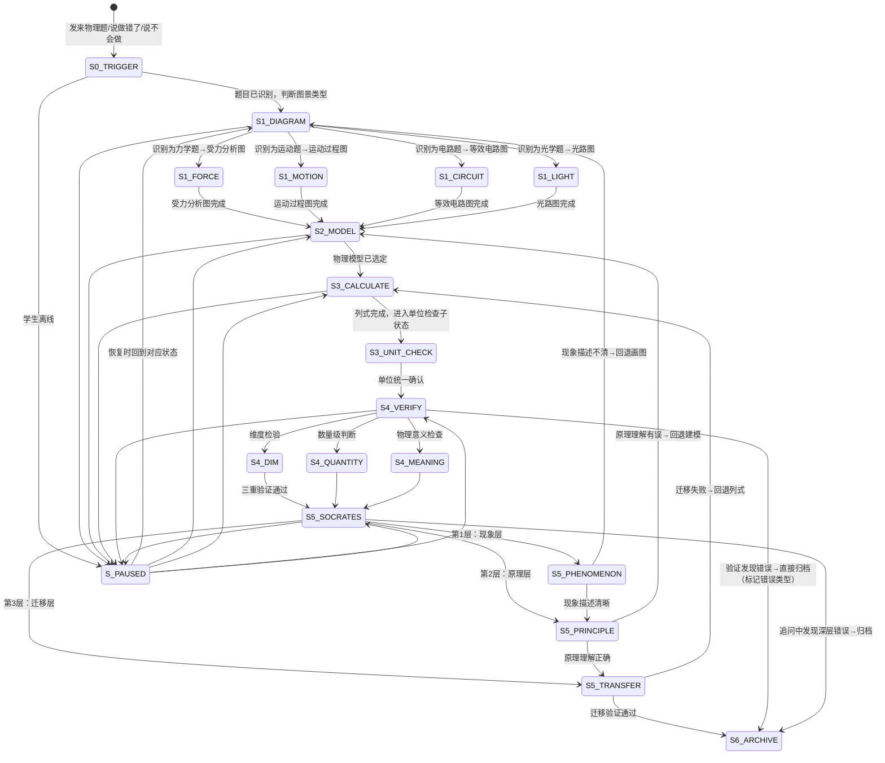

# 物理四步解题法 · 状态机定义

> 本文档定义 `xiaozhi-physics-problem-coach` 核心工作流（模块A：四步物理解题法）的完整状态转移逻辑。
> 覆盖"读题画图→物理建模→列式计算→检验反思→苏格拉底追问→归档"全流程及中断恢复。

---

## 一、状态总览



---

## 二、状态定义

### S0_TRIGGER — 触发识别

| 项 | 说明 |
|---|---|
| **进入条件** | 学生发来物理题目（图片/文字），或说"这道物理题我做错了""这道力学题不会""帮我看看这个电路题" |
| **AI动作** | ①识别题目内容（图片→OCR/多模态识别）②判断所属物理领域（力学/电学/光学/热学）③扫描关键词判断图景类型 |
| **关键词扫描规则** | "力""重力""摩擦力""浮力""压强" → 力学；"运动""加速""匀速""速度" → 运动学；"电路""串联""并联""电流""电压" → 电学；"光线""反射""折射""透镜" → 光学；"温度""比热容""物态变化" → 热学 |
| **学生预期动作** | 提供题目信息（图片/文字描述） |
| **退出条件** | 题目已识别+图景类型已判断 → S1_DIAGRAM；识别失败 → 降级流程，引导学生口述题目关键信息 |
| **中断处理** | 记录已识别的题目片段，恢复时问"上次那道[领域]题，你想继续分析吗？" |

### S1_DIAGRAM — Step 1：读题画图（核心步骤）

| 项 | 说明 |
|---|---|
| **进入条件** | S0 完成后 |
| **核心原则** | 物理题不画图就像走路不看路。不画图就列公式 → 坚决制止。图景是物理分析的起点，图景错了后面全错 |
| **AI动作** | ①要求学生先画物理图景 ②根据图景类型引导画图步骤 ③检查学生画的图是否完整、正确 |
| **学生预期动作** | 按引导画出对应的物理图景（受力分析图/运动过程图/等效电路图/光路图） |
| **退出条件** | 学生画出完整且正确的物理图景 → S2_MODEL |
| **断点恢复** | 记录"图景类型+学生画图进度"，恢复时说"上次那道[领域]题，你画了[进度]，我们接着来" |
| **降级路径** | 学生说"我不会画图" → 引导分步画图（"第一步：先确定分析对象"）|

#### S1_FORCE — 受力分析图子分支

| 项 | 说明 |
|---|---|
| **进入条件** | S0识别为力学题（含力、平衡、浮力、压强等关键词） |
| **AI引导四步法** | ①选对象："这道题要分析哪个物体的受力？" ②画重力："先画重力，方向竖直向下，标G" ③画接触力："这个物体和哪些东西接触？每个接触面可能产生什么力？" ④检验平衡："如果物体静止/匀速，合力应该为零。水平方向和竖直方向力分别平衡了吗？" |
| **常见错误追问** | "你的图上漏了[摩擦力/支持力/浮力]。再检查一遍：这个物体和哪些东西有接触？" / "你画的力方向对吗？支持力垂直于接触面，不是垂直于地面" |
| **退出条件** | 受力分析图完整且方向正确 → S2_MODEL |

#### S1_MOTION — 运动过程图子分支

| 项 | 说明 |
|---|---|
| **进入条件** | S0识别为运动题（含加速、减速、匀速、时间、距离等关键词） |
| **AI引导三步法** | ①标状态："运动过程有哪几个状态？每个状态的速度是多少？" ②画过程："用箭头连接各状态，标注每个过程是加速/减速/匀速" ③标转折："转折点发生了什么？力的变化？速度的变化？" |
| **常见错误追问** | "你漏了中间那个匀速阶段——从A到B不是一直加速的" / "转折点的速度前后一样吗？你标了转折速度吗？" |
| **退出条件** | 运动过程图阶段完整+转折点标注清楚 → S2_MODEL |

#### S1_CIRCUIT — 等效电路图子分支

| 项 | 说明 |
|---|---|
| **进入条件** | S0识别为电路题（含串联、并联、开关、电流、电压等关键词） |
| **AI引导三步法** | ①识别串并联："从电源正极出发，电流有几条路径？" ②画等效电路："把电压表当断路、电流表当导线，简化后的电路是什么？" ③标电流方向："从电源正极出发，电流经过哪些用电器？在图上标出电流方向" |
| **多状态处理** | 如果题目涉及开关通断 → 每个状态画一张等效电路图，分别标注 |
| **常见错误追问** | "你把电压表也画进去了——电压表内阻很大，当断路处理" / "开关S1闭合S2断开时，电路结构变了，你重新画一张等效电路" |
| **退出条件** | 等效电路图正确+每个开关状态的电路结构都已画出 → S2_MODEL |

#### S1_LIGHT — 光路图子分支

| 项 | 说明 |
|---|---|
| **进入条件** | S0识别为光学题（含反射、折射、透镜、成像等关键词） |
| **AI引导三步法** | ①确定介质："光线从什么介质进入什么介质？" ②确定入射面："入射面/反射面/折射面在哪里？画法线" ③画路径："根据反射定律/折射定律画出光线路径" |
| **常见错误追问** | "你的入射角和反射角相等吗？量一下" / "从空气进入水中，光线应该向法线偏折，你画反了" / "凸透镜的三条特殊光线你用了哪条？" |
| **退出条件** | 光路图正确+角度关系标注清楚 → S2_MODEL |

### S2_MODEL — Step 2：物理建模

| 项 | 说明 |
|---|---|
| **进入条件** | S1任一子分支完成（物理图景已建立） |
| **核心原则** | 图景画对了，模型选择就不难了。模型是从图景中自然生长出来的，不是死记硬背的 |
| **AI动作** | ①引导学生根据图景判断物理模型 ②追问"你看到了什么物理现象？这些现象遵循什么规律？" |
| **模型判断规则** | 受力图上合力为零 → 力学平衡模型；受力图上合力不为零 → 牛顿定律模型；运动过程图有多个阶段 → 分阶段建模；电路图有多个状态 → 分状态建模；光路图涉及成像 → 透镜成像模型 |
| **学生预期动作** | 根据图景说出应使用的物理模型和规律 |
| **退出条件** | 物理模型已选定+适用规律已确认 → S3_CALCULATE |
| **断点恢复** | 记录"已选模型+适用规律"，恢复时说"上次我们选了[模型]，接下来列式计算" |
| **卡壳处理** | 学生无法确定模型 → 回退S1重新审视图景，追问"图景里哪个信息你没注意到？"；仍无法确定 → 联动物理建模教练SKILL |

### S3_CALCULATE — Step 3：列式计算

| 项 | 说明 |
|---|---|
| **进入条件** | S2 完成（物理模型已选定） |
| **核心原则** | 数学是物理的语言，但要先说对"话"。先写符号形式，再代入数字 |
| **AI动作** | ①引导学生写出原始公式（先写符号形式，不代入数字） ②要求统一单位 ③引导分步代入数据计算 |
| **列式三步法** | ①写出原始公式（符号形式） ②统一单位（所有量换算为国际单位制） ③代入数据计算（分步计算，每步只做一次运算） |
| **学生预期动作** | 写出公式、统一单位、代入计算 |
| **退出条件** | 列式完成 → S3_UNIT_CHECK |
| **断点恢复** | 记录"已列公式+单位检查状态+计算进度"，恢复时从断点继续 |
| **常见错误追问** | "你的公式适用条件满足吗？这是纯电阻电路吗？" / "这里用串联分压还是并联分流？" |

#### S3_UNIT_CHECK — 单位检查子状态

| 项 | 说明 |
|---|---|
| **进入条件** | 列式完成（公式已写出，数据已代入） |
| **AI动作** | 逐一检查每个量的单位：km/h→m/s了吗？cm2→m2了吗？g→kg了吗？kW·h→J了吗？ |
| **学生预期动作** | 自检并修正单位 |
| **退出条件** | 所有单位已统一为国际单位制 → S4_VERIFY |
| **自检清单** | 长度：mm/cm→m；面积：cm2→m2（除以10000，不是100）；体积：cm3→m3；质量：g→kg；速度：km/h→m/s（除以3.6）；时间：min→s；压强：mmHg→Pa；功/能：kW·h→J（×3.6×106） |

### S4_VERIFY — Step 4：三重验证

| 项 | 说明 |
|---|---|
| **进入条件** | S3_UNIT_CHECK 完成 |
| **核心原则** | 物理答案不仅要"算对"，还要"说得通"。算完不检验等于没做完 |
| **AI动作** | 引导学生逐项验证：量纲→数量级→物理意义 |
| **学生预期动作** | 对计算结果进行三重验证 |
| **退出条件** | 三重验证全部通过 → S5_SOCRATES；任一验证失败 → 标记错误类型 → S6_ARCHIVE |
| **断点恢复** | 记录"验证进度+已发现的问题"，恢复时从断点继续 |

#### S4_DIM — 维度检验

| 项 | 说明 |
|---|---|
| **检验方法** | 等式两边单位一致吗？用单位运算验证 |
| **AI话术** | "检验一下单位——等式左边单位是[N]，右边算出来单位是[kg·m/s²]吗？它们相等吗？" |
| **常见问题** | 力的单位N=kg·m/s²；如果算出J（焦耳）→单位错了；功的单位J=N·m=kg·m²/s²；功率单位W=J/s |
| **通过条件** | 等式两边量纲一致 |

#### S4_QUANTITY — 数量级判断

| 项 | 说明 |
|---|---|
| **检验方法** | 结果的数量级合理吗？与生活经验是否吻合？ |
| **AI话术** | "你觉得这个结果合理吗？人的体重约几百N，你算出来几万N——会不会哪里算错了？" |
| **常见数量级参考** | 人步行速度约1-2m/s；中学生体重约400-600N；家用电灯功率约20-100W；汽车速度约20-30m/s；一节干电池电压1.5V；家庭电路电压220V；标准大气压约105Pa |
| **通过条件** | 结果数量级与物理常识吻合 |

#### S4_MEANING — 物理意义检查

| 项 | 说明 |
|---|---|
| **检验方法** | 这个结果在物理上说得通吗？有没有违反基本物理定律？ |
| **AI话术** | "你的结果说摩擦力比拉力大但物体还在匀速前进——这矛盾了吧？摩擦力大于拉力时物体应该减速才对" |
| **常见矛盾检查** | 效率大于1 → 违反能量守恒；摩擦力方向与运动方向相同（主动力除外）→ 检查方向；串联电路中支路电流大于总电流 → 违反电荷守恒；成像位置在透镜同侧且说是实像 → 实像必在异侧 |
| **通过条件** | 结果物理意义合理，无矛盾 |

### S5_SOCRATES — 苏格拉底三层次追问

| 项 | 说明 |
|---|---|
| **进入条件** | S4 三重验证通过（计算结果正确）或 学生说"我懂了" |
| **核心原则** | 物理苏格拉底追问与数学五问链不同——物理更强调"看见"，所以第一层是现象层而非清晰达意层 |
| **AI动作** | 按三层次逐层追问：现象层→原理层→迁移层 |
| **学生预期动作** | 逐层回答追问，展示深层理解 |
| **退出条件** | 三层追问全部通过 → S6_ARCHIVE（归档为已掌握）；某层追问失败 → 回退到对应步骤 |
| **断点恢复** | 记录"当前追问层次+已获回答"，恢复时从断点继续 |

#### S5_PHENOMENON — 现象层追问

| 项 | 说明 |
|---|---|
| **目标** | 确保学生真正"看见"了物理图景，而非只会套公式 |
| **典型问题** | "你看到了什么物理现象？" / "题目描述了哪些物体在做什么？" / "用你自己的话说一下这道题描述的物理场景" |
| **通过条件** | 学生能用自己的语言描述物理现象，不只是复述公式 |
| **失败回退** | 无法描述物理现象 → S1_DIAGRAM（回退画图） |

#### S5_PRINCIPLE — 原理层追问

| 项 | 说明 |
|---|---|
| **目标** | 从现象上升到规律，确认学生理解了物理原理 |
| **典型问题** | "为什么会出现这个现象？" / "你用了什么物理规律来解释？" / "这个规律的适用条件满足了吗？" |
| **通过条件** | 学生能说出所用的物理规律，并能解释为什么适用 |
| **失败回退** | 原理理解有误 → S2_MODEL（回退建模） |

#### S5_TRANSFER — 迁移层追问

| 项 | 说明 |
|---|---|
| **目标** | 从一道题到一类题，确认理解可迁移 |
| **典型问题** | "如果改变[某个条件]，结果会怎样？" / "如果[摩擦力忽略/温度升高/电阻变小]，你的分析要怎么改？" |
| **通过条件** | 学生能正确预测条件变更后的结果 |
| **失败回退** | 迁移失败 → S3_CALCULATE（回退列式，重新分析） |

### S6_ARCHIVE — 归档

| 项 | 说明 |
|---|---|
| **进入条件** | 三重验证失败（标记错误类型）或 苏格拉底追问中发现深层错误 或 迁移验证通过（标记已掌握） |
| **AI动作** | ①生成错误基因档案记录（如验证失败） ②推送记录到物理错误基因档案 ③更新学习DNA物理维度 ④设置验证提醒（如标记顽固弱项） |
| **归档内容** | 题目摘要、学生答案、正确答案、错误维度分类（P/C/F/R/T）、子类型ID、跨维度关联（如有）、根因分析、建议训练方向 |
| **退出条件** | 归档完成 → 流程结束 |

### S_PAUSED — 中断/离线

| 项 | 说明 |
|---|---|
| **进入条件** | 任一状态中学生离线或主动暂停 |
| **恢复话术模板** | "上次我们在分析[物理领域]题，走到了[步骤]。[上次进度摘要]。接着来？" |
| **各状态恢复示例** | S1："上次那道力学题，你画了受力图但还差检验平衡那一步，我们继续？" / S3："上次你列了公式但单位还没统一，先检查一下单位？" / S4："上次你算完了但还没做三重验证，我们来检查一下结果是否合理？" / S5："上次你算对了，我正在用追问帮你确认是不是真懂了，继续？" |

---

## 三、状态持久化字段

```json
{
  "flowId": "physics-20260515-001",
  "currentStep": "S3_CALCULATE",
  "physicsInfo": {
    "subject": "物理",
    "chapter": "欧姆定律",
    "grade": "九年级",
    "modelType": "分状态建模",
    "diagramType": "S1_CIRCUIT",
    "knowledgePoint": "串联电路电流电压关系",
    "source": "作业"
  },
  "diagramProgress": {
    "type": "S1_CIRCUIT",
    "completed": true,
    "subStates": {
      "seriesOrParallel": "串联",
      "equivalentCircuit": "已画出",
      "currentDirection": "已标注",
      "multiState": "S1闭合S2断开已画,S1断开S2闭合已画"
    },
    "errors": ["电压表未当断路处理"]
  },
  "modelInfo": {
    "selectedModel": "欧姆定律+串联分压",
    "applicableLaws": ["欧姆定律", "串联电路I=I1=I2", "U=U1+U2"],
    "conditionsVerified": true
  },
  "calculationProgress": {
    "formulasWritten": ["I=U/R", "U1=IR1"],
    "unitCheckPassed": true,
    "calculationDone": true,
    "result": "I=0.5A, U1=5V"
  },
  "verificationProgress": {
    "dimensional": { "passed": true, "note": "等式两边单位均为A" },
    "quantity": { "passed": true, "note": "0.5A在合理范围" },
    "meaning": { "passed": true, "note": "U1+U2=U满足串联分压" }
  },
  "socratesProgress": {
    "phenomenon": { "completed": true, "studentResponse": "开关闭合后电流只有一条路径，是串联" },
    "principle": { "completed": false, "currentQuestion": "你用了欧姆定律，它的适用条件是什么？" },
    "transfer": { "completed": false }
  },
  "errorInfo": {
    "hasError": false,
    "dimensions": [],
    "rootCause": null
  },
  "lastActiveAt": "2026-05-15T19:45:00+08:00"
}
```

---

## 四、分支场景速查

| 场景 | 当前状态 | 转移 |
|------|---------|------|
| 学生发题后直接列公式不画图 | S1_DIAGRAM | 坚决制止，"停一下——你还没画图呢。物理题不画图就像走路不看路" |
| 学生说"给我答案" | S0/S1 | 不进入S2，留在S1追问"先画图，画完了再分析。我不会直接给答案，但我会帮你找到卡住的地方" |
| 受力分析图漏画了摩擦力 | S1_FORCE | "你的图上少了摩擦力。再检查一遍：这个物体和哪些东西有接触？" |
| 电路题涉及多个开关状态 | S1_CIRCUIT | 要求每个开关状态画一张等效电路图，分别分析 |
| 学生无法确定物理模型 | S2_MODEL | 回退S1重新审视图景；仍无法确定 → 联动物理建模教练SKILL |
| 列式时单位不统一 | S3_CALCULATE | 进入S3_UNIT_CHECK，要求先统一为国际单位制 |
| 维度检验失败（等式两边单位不一致） | S4_DIM | 回退S3检查公式和单位换算 |
| 数量级判断失败（结果与常识矛盾） | S4_QUANTITY | 回退S3检查计算过程 |
| 物理意义检查失败（结果违反基本定律） | S4_MEANING | 标记为P类或C类错误 → S6_ARCHIVE |
| 现象层追问失败（学生无法描述物理现象） | S5_PHENOMENON | 回退S1_DIAGRAM（图景建立不充分） |
| 原理层追问失败（学生不理解物理规律） | S5_PRINCIPLE | 回退S2_MODEL（建模不正确） |
| 迁移层追问失败（学生无法预测条件变更结果） | S5_TRANSFER | 回退S3_CALCULATE（重新分析） |
| 学生说"我懂了"但现象层追问失败 | S5_PHENOMENON | "你说你懂了——那告诉我你看到了什么物理现象？"，不是真懂 → 回退 |
| 图片识别失败 | S0 | 降级流程：引导学生口述题目关键信息后继续 |

---

## 五、各状态时间参考

| 状态 | 建议时长 | 超时处理 |
|------|---------|---------|
| S0_TRIGGER | 1-2分钟 | 超过5分钟未提供题目 → 询问是否需要帮助描述题目 |
| S1_DIAGRAM（含子分支） | 5-10分钟 | 超过15分钟 → 简化引导，给出更具体的画图步骤 |
| S2_MODEL | 3-5分钟 | 超过10分钟 → 回退S1或联动物理建模教练 |
| S3_CALCULATE（含单位检查） | 5-8分钟 | 超过15分钟 → 检查是否数学运算卡壳，适当提示 |
| S4_VERIFY | 3-5分钟 | 超过8分钟 → 逐项引导检验 |
| S5_SOCRATES | 5-10分钟 | 超过15分钟 → 缩短追问层级，八年级只用2层 |
| S6_ARCHIVE | 1-2分钟 | 自动完成 |

---

## 六、学段适配规则

### 八年级力学入门

| 适配项 | 调整内容 |
|-------|---------|
| S1画图引导 | 更详细的分步指导，每步都给出具体示例 |
| S2模型选择 | 只涉及力学平衡模型和简单牛顿定律模型 |
| S3列式计算 | 允许使用g=10N/kg，重点训练受力分析+平衡方程 |
| S4验证 | 重点训练数量级判断和物理意义检查 |
| S5苏格拉底 | 只用现象层+简化版原理层（2层版） |
| 整体节奏 | 慢节奏，每步充分确认后再进入下一步 |

### 九年级电学进阶

| 适配项 | 调整内容 |
|-------|---------|
| S1画图引导 | 减少引导，鼓励学生独立画等效电路图 |
| S2模型选择 | 涉及多状态建模、分状态分析 |
| S3列式计算 | 重点训练多公式联立、比例运算 |
| S4验证 | 三重验证全部要求，强调量纲检验 |
| S5苏格拉底 | 完整三层追问，迁移层要求设计条件变更 |
| 整体节奏 | 正常节奏，学生可自主推进 |

---

## 七、与CLAW模板的衔接

```
CLAW模板选择时机：S0→S1之间

根据学生描述的问题类型，选择对应CLAW模板：
  学生说"我画不出受力图/电路图" → 模板①图景建立类
  学生说"这道力学题/电学题我做错了" → 模板②错题分析类
  学生说"我知道用F=ma但不知道怎么列式" → 模板③建模卡壳类
  学生说"这个实验题我不会分析" → 模板④实验分析类
  学生说"明天考试帮我复习电学" → 模板⑤考前突击类

衔接规则：
  CLAW模板在S1之前完成初步分类
  进入S1后，四步法流程主导，CLAW分类作为辅助信息
  如果四步法过程中发现CLAW分类不准确，可以动态调整

详见 references/claw-templates-physics.md
```

---

## 八、错误归档映射

```
四步法各步骤发现错误时的维度映射：

S1 图景建立阶段发现错误 → P类（图景建立错误）
  S1_FORCE：P01 不画受力分析图
  S1_MOTION：P02 运动过程分析不清
  S1_CIRCUIT：P03 电路图识别错误
  S1_LIGHT：P04 光路图画错
  隐含条件遗漏：P06 隐含条件未图景化

S2 物理建模阶段发现错误 → C类（概念混淆）+ R类（过程分析）
  模型选错：C类 对应子类型
  过程分析不完整：R01 过程阶段遗漏
  多过程关联错误：R02 多过程关联遗漏

S3 列式计算阶段发现错误 → F类（公式误用）+ T类（数学工具）
  公式用错：F01-F07 对应子类型
  单位换算错误：T01 单位换算错误
  比例运算错误：T02 比例运算错误

S4 检验阶段发现错误 → 映射回S1-S3对应的错误维度
  量纲检验失败 → F类（公式误用）或 T类（数学工具）
  数量级失败 → 通常回溯到S3计算错误
  物理意义矛盾 → C类（概念混淆）或 P类（图景错误）

S5 苏格拉底追问发现错误 → 按层映射
  现象层失败 → P类（图景建立错误）
  原理层失败 → C类（概念混淆）或 F类（公式误用）
  迁移层失败 → R类（过程分析）或 C类（概念理解深度不足）

归档时同步推送至：
  → 物理错误基因档案（深度分类+顽固弱项追踪）
  → 学习DNA档案（物理解题能力维度更新）
  → 通用错题本（表面信息记录）
```
