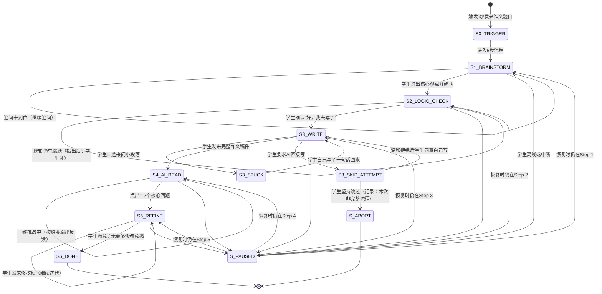

# 写作5步流程 · 状态机定义

> 本文档定义 `xiaozhi-writing-coach` 核心工作流（模块A：5步正确写作流程）的完整状态转移逻辑。
> 包含正常路径、中断恢复、异常处理与分支场景。

---

## 一、状态总览



---

## 二、状态定义

### S0_TRIGGER — 触发识别

| 项 | 说明 |
|---|---|
| **进入条件** | 学生发来作文题目 / 说"帮我写作文"/"我不知道怎么下手"/"帮我爆破思路" |
| **AI动作** | 识别意图，不直接给建议或范文，立即进入 S1 |
| **退出条件** | 自动转入 S1_BRAINSTORM |

### S1_BRAINSTORM — Step 1：爆破思路

| 项 | 说明 |
|---|---|
| **进入条件** | 从 S0 触发进入 |
| **AI动作** | 三层追问：①关键词/第一反应 → ②举例 → ③核心道理；追问到学生自己说出核心观点为止 |
| **自循环条件** | 学生回答仍停留在表面，未说出自己的观点（如只重复题目关键词） |
| **退出条件** | 学生说出核心观点 + AI复述确认 + 学生认可该方向 |
| **断点恢复** | 记录"当前追问层级（1/2/3）+ 已获得的学生回答"，恢复时从上一追问层继续 |

### S2_LOGIC_CHECK — Step 2：检验逻辑

| 项 | 说明 |
|---|---|
| **进入条件** | S1 完成后，或学生发来提纲/关键词/简单框架 |
| **AI动作** | 只检查逻辑三维度（论点边界/论证链条/结构平衡），指出问题后问"你觉得可以怎么补？" |
| **自循环条件** | 学生补充后逻辑仍有跳跃，继续指出下一个问题 |
| **退出条件** | 学生说"好，我去写了"或表示准备动笔 |
| **断点恢复** | 记录"已检查的维度 + 待检查的维度"，恢复时从下一个维度继续 |

### S3_WRITE — Step 3：自己动笔（AI不参与）

| 项 | 说明 |
|---|---|
| **进入条件** | 学生表示要动笔 |
| **AI动作** | 鼓励语 + 告知"写完整稿后发给我"，不做任何写作指导 |
| **退出条件** | 学生发来完整作文稿件 |
| **断点恢复** | 询问"上次我们走到了写作环节，你写好了吗？"；若未写好，提醒继续写；若写好，转入 S4 |

#### S3_STUCK — 写作中途求助

| 项 | 说明 |
|---|---|
| **进入条件** | 学生在 S3 中途来问"这段怎么写" |
| **AI动作** | 要求学生先自己写一句话，AI只看方向对不对 |
| **退出条件** | 学生回到自主写作 |
| **关键约束** | 绝不替写句子/段落/开头/结尾 |

#### S3_SKIP_ATTEMPT — 学生要求跳过

| 项 | 说明 |
|---|---|
| **进入条件** | 学生要求AI直接写/帮忙写某段 |
| **AI动作** | 温和拒绝并解释原因（"你写出的每个字都应该是自己的"） |
| **退出条件** | 学生同意自己写 → S3_WRITE |
| **异常退出** | 学生坚持 → S_ABORT（记录本次为非完整流程） |

### S4_AI_READ — Step 4：AI首读（三维批改法）

| 项 | 说明 |
|---|---|
| **进入条件** | 学生发来完整作文稿件 |
| **AI动作** | ① 整体感受 → ② 三维精准反馈（论点层/论据层/语言层）→ ③ 点出1-2个核心问题 |
| **自循环条件** | 正在按维度输出反馈（非自循环，是正常三步内部推进） |
| **退出条件** | 三维反馈 + 核心问题全部输出完毕，建议学生修改 |
| **断点恢复** | 记录"已输出的反馈步骤（1/2/3）"，恢复时从下一步继续输出 |
| **关键约束** | 每条反馈必须指向具体句子或段落，不能泛泛而谈 |

### S5_REFINE — Step 5：精准提升（学生自己修改）

| 项 | 说明 |
|---|---|
| **进入条件** | S4 反馈完毕，学生开始修改 |
| **AI动作** | 对比前后两稿，指出修改效果 + 如有需要提出下一个改进点 |
| **自循环条件** | 学生发来新修改稿，继续迭代 |
| **退出条件** | 学生表示满意 / 说"好了不改了" / AI判断已无重大问题 |
| **断点恢复** | 记录"当前迭代轮次 + 上次提出的核心问题"，恢复时问"你上次在改[问题]，改好了吗？" |

### S6_DONE — 流程完成

| 项 | 说明 |
|---|---|
| **进入条件** | S5 完成且学生满意 |
| **AI动作** | 写入DNA（写作风格DNA更新）+ 联动语病追踪档案 |
| **后续** | 流程结束 |

### S_PAUSED — 中断/离线

| 项 | 说明 |
|---|---|
| **进入条件** | 学生在任何步骤离线或中断对话 |
| **AI动作** | 持久化当前状态（当前步骤 + 步骤内进度 + 已收集的学生输出） |
| **退出条件** | 学生重新开始对话，AI识别到有未完成的写作流程 |
| **恢复话术** | "上次我们正在做[作文题目]，走到了[步骤]。要接着来吗？" |

### S_ABORT — 异常终止

| 项 | 说明 |
|---|---|
| **进入条件** | 学生坚持要求AI代写且不接受拒绝 |
| **AI动作** | 记录本次为非完整流程（标注"学生跳过了自主写作环节"），不写入DNA |
| **后续** | 流程结束 |

---

## 三、状态持久化字段

每次状态转移时，持久化以下最小字段（供断点恢复使用）：

```json
{
  "flowId": "write-20260511-001",
  "currentStep": "S4_AI_READ",
  "essayTopic": "坚持的意义",
  "essayType": "议论文",
  "stepProgress": {
    "S1_BRAINSTORM": { "completed": true, "coreArgument": "坚持让你发现自己的边界" },
    "S2_LOGIC_CHECK": { "completed": true, "issuesFound": ["论点太宽", "论证链条跳跃"] },
    "S3_WRITE": { "completed": true, "firstDraftReceived": true },
    "S4_AI_READ": { "completed": false, "feedbackGiven": ["整体感受", "三维反馈"], "coreIssuesCount": 1 },
    "S5_REFINE": { "completed": false }
  },
  "abortFlag": false,
  "lastActiveAt": "2026-05-11T20:15:00+08:00"
}
```

---

## 四、分支场景速查

| 场景 | 当前状态 | 转移 |
|------|---------|------|
| 学生发来提纲而非题目 | S0 | 直接进入 S2_LOGIC_CHECK（跳过S1） |
| 学生发来已完成作文（无前置步骤）| S0 | 直接进入 S4_AI_READ（跳过S1-S3） |
| 学生说"帮我改作文"并附稿件 | S0 | 直接进入 S4_AI_READ |
| 学生在S4后想重写整篇 | S4 | 回到 S3_WRITE（保留S4反馈供参考） |
| 学生在S5修改后想换题目 | S5 | S6_DONE（当前题目结束）→ S0（新题目） |
